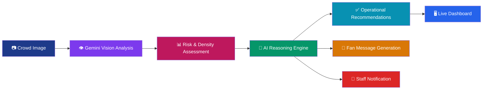

<div align="center">

# 🏟️ ZoneWatch AI

### Real-time crowd intelligence for the world's biggest stadiums

**AI-powered congestion detection, risk assessment, and operational decision support — built for FIFA World Cup 2026 scale.**

[](https://nextjs.org/)
[](https://www.typescriptlang.org/)
[](https://ai.google.dev/)
[](https://vercel.com/)

[Live Demo](#) · [Report Bug](#) · [Request Feature](#)

</div>

---

## 📖 Overview

Picture a stadium holding **80,000+ fans** on World Cup final day. Gates are surging, concourses are packing shoulder-to-shoulder, and ops teams are relying on radio calls and gut instinct to figure out where the next bottleneck will break.

**ZoneWatch AI** turns a single crowd photo into an actionable operations briefing in seconds. Upload an image from any zone — a gate, a concourse, an exit ramp — and Google Gemini's vision and reasoning capabilities do the rest: estimating density, spotting hazards, and generating clear, role-specific instructions for the people who need to act on them.

It's not a dashboard that shows you numbers. It's a copilot that tells you **what's wrong and what to do about it.**

---

## ❗ Problem Statement

Large-scale tournaments like the FIFA World Cup 2026 concentrate massive crowds into fixed physical spaces, and the operational reality on the ground is tough:

- 🚧 **Congestion builds faster than humans can monitor** — by the time a bottleneck is reported, it's already a safety risk.
- 👀 **Manual crowd monitoring doesn't scale** — CCTV feeds and radio reports depend entirely on how many eyes are watching, and where.
- 🌐 **Fans and staff speak different languages** — critical safety messaging often reaches only part of the crowd.
- 📋 **Decisions lag behind reality** — stewards and organizers frequently react to congestion instead of preventing it.
- ♿ **Accessibility and safety needs are easy to miss** — blocked aisles or lost egress routes can go unnoticed until it's too late.

The result: slower response times, avoidable safety incidents, and a degraded experience for fans — exactly when stakes and crowd volumes are at their highest.

---

## 💡 Solution

**ZoneWatch AI** closes the gap between *seeing* a problem and *acting* on it.

1. A photo from any stadium zone is uploaded (or pulled from a camera feed in future versions).
2. **Google Gemini's Vision API** analyzes the image directly — reading crowd density, spacing, and visible hazards.
3. Gemini's **generative reasoning** converts that visual read into a structured operational brief: risk level, hazard description, and a recommended action.
4. The system auto-drafts **two outputs** — an internal instruction for staff, and a calm, fan-facing safety message.
5. Everything lands on a live, zone-based **operations dashboard** so teams can monitor multiple areas at once.

The result is a tool that doesn't just flag a problem — it tells the right person, in the right words, exactly what to do next.

---

## ✨ Features

| | Feature | Description |
|---|---|---|
| 🖼️ | **AI Crowd Image Analysis** | Upload any zone photo for instant Gemini-powered vision analysis |
| 📊 | **Crowd Density Estimation** | Quantified occupancy percentage per zone |
| 🚦 | **Risk Level Detection** | Clear Low / Medium / High risk classification |
| ⚠️ | **Hazard Identification** | Pinpoints blocked aisles, missing egress paths, and unsafe packing |
| 🧭 | **AI-Generated Recommendations** | Specific, actionable guidance for operations staff |
| 📢 | **Staff Notification Suggestions** | Auto-routes alerts to the right team (e.g., Crowd Stewards) |
| 🗣️ | **Fan Communication Messages** | Calm, clear public-facing safety messaging generated in real time |
| 🖥️ | **Interactive Stadium Dashboard** | Live overview across multiple zones and gates |
| 📍 | **Zone-Based Analysis** | Independent monitoring for Gate A, Gate B, Concourse, and beyond |
| 📱 | **Responsive Modern UI** | Built for use on ops tablets, laptops, and mobile devices alike |

---

## 🔄 AI Workflow



---

## 🏗️ Architecture

<details>
<summary><b>Click to expand full architecture breakdown</b></summary>

**Frontend**
- Built with **Next.js 16** (App Router) and **React**, written entirely in **TypeScript** for type safety across components.
- Zone-based UI lets operators switch between gates, concourses, and exit ramps without losing context.
- Fully responsive layout styled with modern CSS, designed for both control-room monitors and staff mobile devices.

**AI Layer**
- Crowd images are sent to the **Google Gemini API**, using its multimodal vision capabilities to interpret scene content directly (no separate object-detection model required).
- A structured prompt pipeline asks Gemini to reason step-by-step: identify density → detect hazards → assess risk → propose an action → draft messaging.
- Responses are parsed into structured JSON consumed by the dashboard UI.

**Backend / API Routes**
- Next.js API routes handle image intake, Gemini API calls, and response formatting — keeping the Gemini API key server-side and never exposed to the client.

**Deployment**
- Hosted on **Vercel**, taking advantage of serverless functions for the API layer and edge-optimized delivery for the frontend.
- Environment variables (like the Gemini API key) are managed securely through Vercel's project settings in production.

</details>

---

## 🛠️ Tech Stack

| Layer | Technology |
|---|---|
| Framework | Next.js 16 |
| UI Library | React |
| Language | TypeScript |
| Styling | CSS |
| Generative AI | Google Gemini API (Vision + Text) |
| Hosting / Deployment | Vercel |

---

## ⚙️ Installation

Clone the repository and get it running locally in a few steps:

```bash
# 1. Clone the repository
git clone https://github.com/your-username/zonewatch-ai.git
cd zonewatch-ai

# 2. Install dependencies
npm install

# 3. Configure environment variables
```

Create a `.env.local` file in the project root:

```env
GEMINI_API_KEY=your_api_key
```

> ⚠️ Never commit `.env.local` to version control. Make sure it's listed in your `.gitignore`.

```bash
# 4. Run the development server
npm run dev
```

Then open [http://localhost:3000](http://localhost:3000) in your browser. 🎉

---

## 🚀 Usage

1. **Select or upload a zone image** — drag & drop a photo, or choose from sample images (Gate Crowd, Concourse, Exit Ramp, Aerial View).
2. **Click "Analyze Zone with AI"** to send the image to Gemini for analysis.
3. **Review the AI Analysis Results panel**, which returns:
   - Risk level and crowd density percentage
   - Any detected hazards
   - A recommended action for stadium staff
   - A ready-to-send fan safety message
4. **Dispatch the recommendation** to the relevant team directly from the dashboard.
5. **Switch zones** (Gate A, Gate B, Main Concourse, etc.) to monitor multiple areas of the stadium in parallel.

---

## 🔮 Future Improvements

- 📹 **Live CCTV Integration** — analyze real-time video feeds instead of static image uploads
- 🌍 **Multilingual Fan Announcements** — auto-translate safety messages for international tournament crowds
- 🔥 **Heatmap Visualization** — visualize congestion trends across the entire stadium at a glance
- 🚨 **Emergency Evacuation Assistance** — AI-generated evacuation routing during critical incidents
- 📈 **Predictive Crowd Analytics** — forecast congestion before it happens using historical + live data

---

## 👥 Team

| Name | Role | GitHub |
|---|---|---|
| Afsheen M | Developer / Lead | (https://github.com/Afsheen06) |


---

## 📄 License

This project is licensed under the **MIT License** — see the [LICENSE](LICENSE) file for details.

<div align="center">

**Built with 💙 for FIFA World Cup 2026 · PromptWars Challenge 4**

</div>
